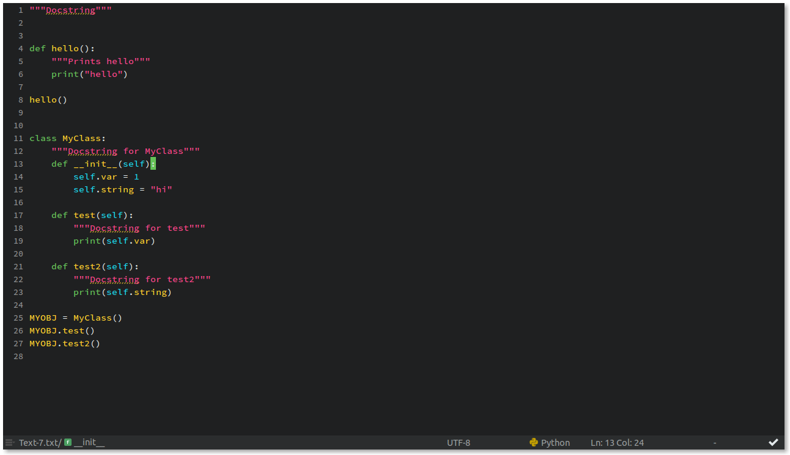
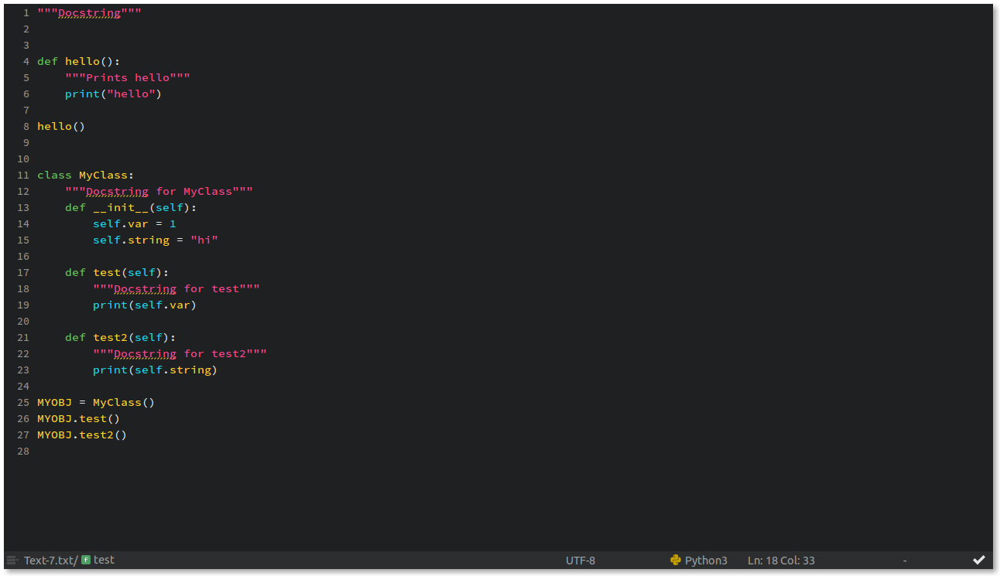

Lemmo
===

## Description
A dark flat color scheme for Komodo 9 called "Lemmo".

## How to install?
Using Commando Packages, find "Lemmo" and press Enter to install it.

## Screenshots
* PHP

* HTML

* JS

* CSS

* Python

* Python 3

